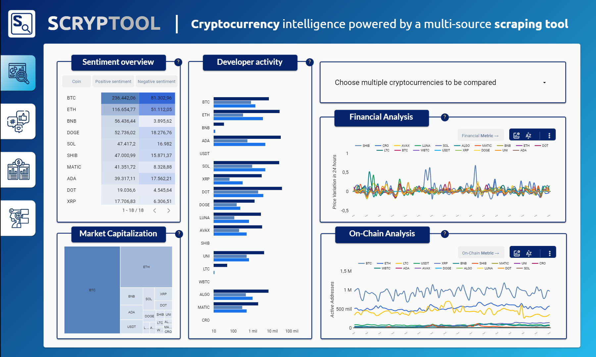
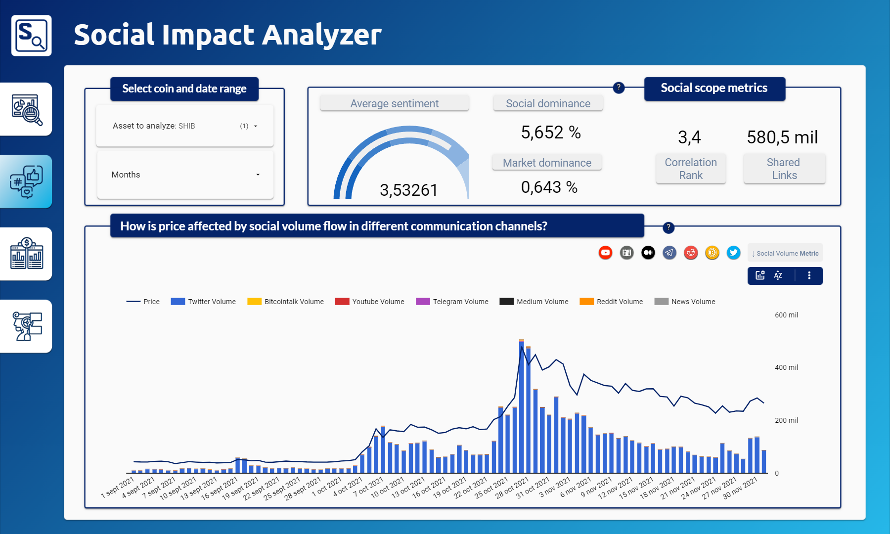
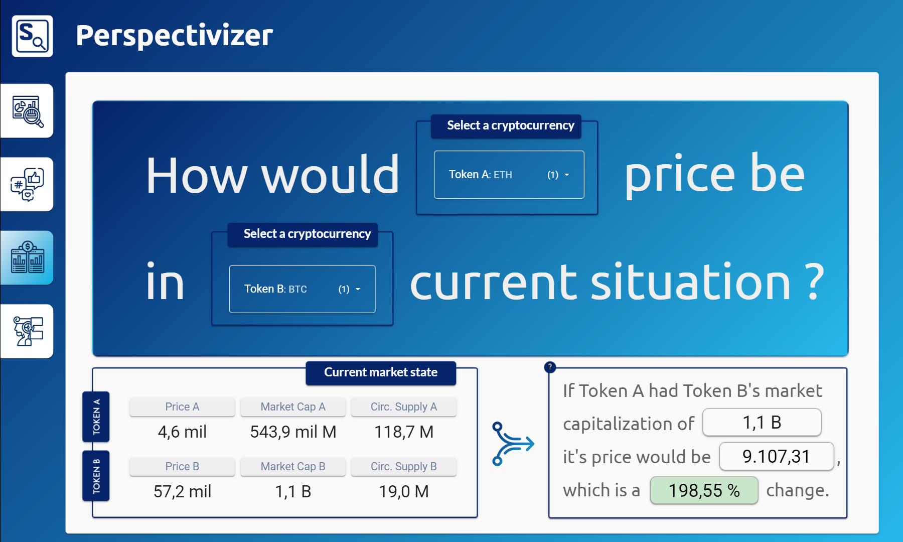
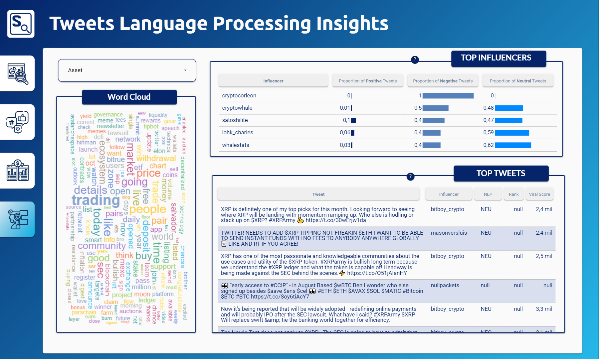

# scryptool
Social analysis tool for cryptocurrencies.


## Table of contents
1. [Installation](#installation)
2. [Cryptocurrencies](#cryptocurrencies)
3. [API Wrappers](#api-wrappers)
    1. [Santiment API](#1-santiment-api)
    2. [LunarCrush API](#2-lunarcrush-api)
       1. [Metrics description](#lc-metrics-description)
    3. [Twitter API](#3-twitter-api)
    4. [Async Twitter Scraper](#4-async-twitter-scraper)
    5. [Other Wrappers](#5-other-wrappers)
       1. [GlassNode API](#5-other-wrappers)
       2. [Kraken-Futures API](#5-other-wrappers)
3. [Data Analysis](#data-analysis)
    1. [Market Overview](#1-market-overview)
    2. [Social Impact Analyzer](#2-social-impact-analyzer)
    3. [Perspectivizer](#3-perspectivizer)
    4. [NLP for Tweets](#4-nlp-for-tweets)
4. [Project Organization](#project-organization)


## Installation
Create a **Python 3.8** virtual environment and run the following command:
```
pip install -r requirements.txt
```
## Cryptocurrencies
List of the **18 cryptocurrencies** that have been analyzed.

|     |     |     |     |     |     |     |     |     |
|-----|-----|-----|-----|-----|-----|-----|-----|-----|
| ***BTC*** | ***ETH*** | ***BNB*** | ***USDT*** | ***SOL*** | ***ADA*** | ***XRP*** | ***DOT*** | ***LUNA*** |
| ***DOGE*** | ***AVAX*** | ***SHIB*** | ***CRO*** | ***MATIC*** | ***WBTC*** | ***ALGO*** | **LTC** | **UNI** |

## API Wrappers
### 1. SANTIMENT API
| Method      | Description     |
|--------------|-----------|
| **list_all_coins()** | List all available coins in Santiment
| **get_price()** | Price (USD)
| **get_volume()** | Volume (USD)
| **get_daily_trading_volume()** | Daily trading volume (USD)
| **get_marketcap()** | Market Cap (USD)
| **get_social_volume()** | Social volume based on platform (Twitter, Reddit, Telegram, BitcoinTalk)
| **get_sentiment_balance()** | Sentiment balance of a coin
| **get_social_dominance()** | Social dominance of a coin
| **get_sentiment()** | Sentiment score (positive / negative)
| **get_development_activity()** | Development activity
| **get_github_activity()** | Github activity
| **get_active_addresses_24h()** | On-Chain Active addresses (24h)
| **get_exchange_balance()** | On-Chain Exchange_balance
| **get_network_growth()** | On-Chain Network growth
| **get_transaction_volume()** | On-Chain Transaction volume
| **get_perpetual_funding_rate()** | On-Chain Perpetual funding rate
| **get_circulation()** | On-Chain Circulation supply
| **get_velocity()** | On-Chain Velocity
| **get_withdrawal_transactions()** | On-Chain Withdrawal transactions
------------------------------------------------------------
### 2. LUNARCRUSH API

Here is a short description for the LunarCrush API v2 endpoints and their respective methods.
You can find more details about the request parameters [here](https://legacy.lunarcrush.com/developers/docs) 

| Method         | Description     |
|--------------|-----------|
| **get_assets()** | Details, overall metrics, and time series metrics for one or multiple assets.      |
| **get_market_pairs()** | Provides the exchange information for assets, and the other assets they are being traded for.  |
| **get_market()** | Summary information for all supported assets (Markets page) including 5 recent time series values for some metrics.  |
| **get_global()** | Overall aggregated metrics for all supported assets (top of Markets page).  |
| **get_meta()** | Meta information for all supported assets  |
| **get_exchanges()** | Meta information for all exchanges that we track  |
| **get_exchange()** | Meta information and market pairs for a single exchange that we track  |
| **get_coin_of_the_day()** | The current coin of the day  |
| **get_coin_of_the_day_info()** | Provides the history of the coin of the day on LunarCRUSH when it was last changed, and when each coin was last coin of the day  |
| **get_feeds()** | Social posts, news, and shared links for one or multiple coins.  |
| **get_influencers()** | List of social accounts that have the most influence on different assets based on number of followers, engagements and volume of posts.  |
| **get_influencer()** | Individual influencer details including actual posts.  |
------------------------------------------------------------
### LC Metrics description
| Metric         | Description     |
|--------------|-----------|
| **GALAXY SCORE** | The Galaxy Score™ indicates how healthy a coin is by looking at combined performance indicators across markets and social engagement. Display the real-time Galaxy Score™ of any coin. |
| **ALT RANK** | AltRank™ measures a coin's performance VS. all other coins that we actively support. In general, it is a unique measurement that combines ALT coin price performance relative to Bitcoin and other social activity indicators across the entire crypto market. A coin can have a high AltRank of 1 even in a bear market situation. |
| **INFLUENCERS** | View Twitter influencer activity and their impact across all coins and tokens. All influencers are measured by the same metrics, which includes followers, replies, favorites, and retweets. Metrics are evaluated across all collected posts during the timeframe selected. Actual influence will vary over time and will depend on user activity. |
| **CANDLESTICK** | The incredibly powerful Candlestick widget takes any data point and compares it to price over a specified timeframe. |
| **WORD CLOUD** | Uncover keywords used throughout collected social content for any coin. The Word Cloud is generated from all recent and available social posts from Twitter and Reddit. It looks at frequency of mentions. All data is segmented by either all coins or specific, individual coins. |
| **SOCIAL FEED** | Display social feeds from multiple sources including Twitter, Reddit, news channels and more all at once. Gain unique insights into what's being talked about in real time. All social feeds have been cleaned with spam removed and can be organized by coin. |
------------------------------------------------------------

### 3. TWITTER API
Simple API wrapper for some methods from [**tweepy**](https://github.com/tweepy/tweepy).

| Method         | Description     |
|--------------|-----------|
| **get_user()** | Request user information. |
| **get_all_tweets()** | Request all tweets given a query (Academic Research only). |
| **get_recent_tweets()** | Request recent tweets given a query. |
| **get_all_tweets_count()** | Request all twitter count given a query (Academic Research only). |
| **get_recent_tweets_count()** | Request recent twitter counts given a query. |
------------------------------------------------------------

### 4. ASYNC TWITTER SCRAPER
Asynchronous Twitter scraper is based on [**twint project**](https://github.com/twintproject/twint/) configuration.
New parameters have been added to parallelize the scraping process and filter some information.
The rest parameters can be found in the [configuration file](scrapers/twint/config.py).

| Additional *twint* parameters | Type |  Description  |
|--------------|-----------|-----------|
| **Users** | *dict* | Dictionary to store the **coins** and their respective **users** (parallelization purposes). |
| **Queries** | *dict* | Dictionary to store the **coins** and their respective **queries** (parallelization purposes).|
| **Save_replies** | *bool* | True to store the **replies** of a tweet. |
| **Save_mentions** | *bool* | True to store the **mentions** of a tweet. |
| **Save_meta** | *bool* | True to store **all** the information of the tweets. |
| **Remove_mentions** | *bool* | Remove tweet **mentions**. |
------------------------------------------------------------

### 5. OTHER WRAPPERS
Uncompleted API Wrappers with an example endpoint request.
* **Glassnode API:** Parameter parsing and requesting.
* **Kraken-Futures API:** Parameter parsing and requesting.

These APIs have been considered for getting on-chain data but have not been used in the final project.

------------------------------------------------------------
## DATA ANALYSIS
You can find the complete interactive dashboard [here](https://datastudio.google.com/s/ujtTlFBHWe0)

### 1. MARKET OVERVIEW
Comparison for all 18 coins based on **5 different analysis** (price, market cap., social influence, on-chain and developer activity).



------------------------------------------------------------
### 2. SOCIAL IMPACT ANALYZER
In-depth analysis of key **social metrics** and interactive study of
correlation between price and social talk volume, per coin and month.



------------------------------------------------------------
### 3. PERSPECTIVIZER
Tool that helps to **estimate** a Token A price if it had the **Market Capitalization** of a Token B.



------------------------------------------------------------
### 4. NLP FOR TWEETS
Natural Language Processing of all the **tweets** in the last 3 months from  the **top 10** influencers of each coin



------------------------------------------------------------


## Project Organization

    ├── LICENSE
    ├── README.md
    ├── requirements.txt
    │
    ├── data
    │   ├── dashboard1      <- Data scraped for dashboard 1 (General Overview).
    │   ├── dashboard2      <- Data scraped for dashboard 2 (Social Impact Analysis).
    │   ├── dashboard3      <- Data scraped for dashboard 3 (Perspectivizer).
    │   └── dashboard4      <- Data scraped for dashboard 4 (NLP for tweets).
    │
    ├── images              <- Sample images generated from the dashboards. 
    │
    ├── main.py             <- Main script containing all the scraping and dashboard generation pipeline. 
    ├── dashboard.py        <- Data processing and dataframe creation for dashboards.
    ├── utils.py            <- Util functions.
    │
    ├── nlp                 <- Module for Natural Language Processing (NLP).
    │   ├── __init__.py     <- Makes nlp a Python module.
    │   ├── parsers.py      <- Data processing for parsing and cleaning scraped tweets.
    │   ├── pipeline.py     <- Pipeline for tokenization and word counting.
    │   └── sentiment.py    <- Sentiment analysis functions.
    │ 
    ├── scrapers            <- Module containing the scrapers.
    │   ├── twint           <- Twint repository with custom modifications.
    │   │
    │   ├── __init__.py     <- Makes scrapers a Python module.
    │   ├── glassnode.py    <- Glassnode simple wrapper.
    │   ├── kraken.py       <- Kraken-Futures simple wrapper.
    │   ├── lunarcrush.py   <- Lunarcrush wrapper.
    │   ├── santiment.py    <- Santiment wrapper.
    │   ├── tickers.py      <- Dictionary containing the tickers and their possible written representations.
    │   └── twitter.py      <- Twitter wrappers (tweepy / parallel twint).
    │
    └── _config.py          <- Create your own _config.py file to store the API KEYS
------------------------------------------------------------
